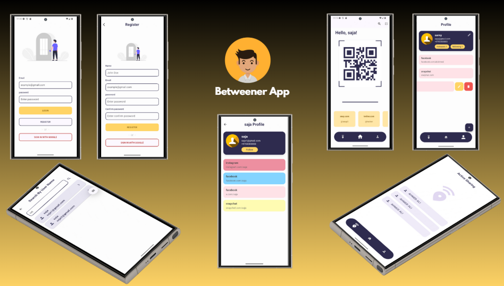

#  Betweener App - Flutter

**Betweener App** is a modern social networking and link-sharing Flutter application.  
It allows users to create personal profiles, share custom links, connect with others, and explore new users easily.  
Built using **Flutter** with a clean architecture and intuitive user experience.

---

## 📱 Features

- 🔗 **Add & Edit Links** – Add and manage your personal or social links.  
- 👤 **User Profile** – View and edit user information and shared links.  
- 🧭 **Explore & Follow** – Search for other users and follow them.  
- 💬 **Friend Profiles** – View details of other users and their shared content.  
- 🔍 **Search by Name** – Quickly find users by username or name.  
- 🧾 **Follow List** – See the list of users you follow and who follow you.  
- 🚀 **Onboarding** – A smooth onboarding experience for new users.  
- 🔒 **Login & Register** – Secure authentication system for account creation and sign-in.  
- 🏠 **Home View** – Central hub displaying user content and links.  
- 📦 **Receive View** – Receive shared content or connections directly.  
- ⚙️ **Edit Profile Info** – Update your name, bio, and profile details.  

---

## 🧭 App Routes

| Route | Description |
|-------|--------------|
| **OnBoardingView** | Introductory screens for new users |
| **LoginView** | User sign-in screen |
| **RegisterView** | Account registration screen |
| **HomeView** | Main home page showing links and activities |
| **MainAppView** | Root layout containing navigation between sections |
| **ProfileView** | Displays the user’s profile and shared links |
| **EditProfileInfoView** | Allows editing personal info like name and bio |
| **AddLinkView** | Add new link to profile |
| **EditLinkView** | Modify existing links |
| **ReceiveView** | Display received links or shared data |
| **FollowlistView** | Shows list of followers and followings |
| **FriendProfileView** | View another user’s public profile |
| **SearchByNameView** | Search for users using name or username |
| **LoadingScreen** | Splash/loading state before app initialization |

---

## 🧩 Widgets & Packages Used

- **MaterialApp & Scaffold** → Core structure and navigation  
- **Navigator & Routes** → Page transitions and routing management  
- **TextField, Buttons, Icons** → UI input and action elements  
- **ListView & GridView** → Display links, followers, and profiles  
- **CircleAvatar** → Profile image display  
- **CircularProgressIndicator** → Loading indicators  
- **BottomNavigationBar** → Main app navigation  
- **SharedPreferences / HTTP** *(depending on implementation)* → State and data management  

---
🔗 **Live Demo:** https://drive.google.com/drive/folders/1Enkh_zKPSR8YCnNjUgyigLllIz0GC9-s?usp=drive_link  

## 📷 Screens 

  

